# Relazione

Relazione del progetto _"FastFood PMW - CodeBite"_ per il corso _"Programmazione Web e Mobile"_ (a.a. 2025/2026).

Realizzata da Filippo Maria Bottaro (matr: 24445A).

- [Testing e Deploy](#testing-e-deploy)
- [Struttura del progetto](#struttura-del-progetto)
  - [Stack tecnologico](#stack-tecnologico)
  - [Motivazioni delle scelte tecnologiche](#motivazioni-delle-scelte-tecnologiche)
  - [Organizzazione codice](#organizzazione-codice)
  - [Database MongoDB](#database-mongodb)
- [Struttura del sito web](#struttura-del-sito-web)
- [Scelte implementative significative](#scelte-implementative-significative)
  - [Autenticazione ed Autorizzazione (JWT)](#autenticazione-ed-autorizzazione-jwt)
    - [Accesso endpoint API protetti (middleware `authMiddleware`)](#accesso-endpoint-api-protetti-middleware-authmiddleware)
    - [Accesso pagine web protette (controllo client-side)](#accesso-pagine-web-protette-controllo-client-side)
    - [Password hashing con bcrypt](#password-hashing-con-bcrypt)
  - [Validazione richieste](#validazione-richieste)
    - [Express Validator](#express-validator)
  - [Upload immagini ristoranti](#upload-immagini-ristoranti)
  - [Gestione stati ordini](#gestione-stati-ordini)
  - [Calcolo tempi di attesa](#calcolo-tempi-di-attesa)
  - [Debouncing ricerche](#debouncing-ricerche)
  - [Notifiche utente standardizzate](#notifiche-utente-standardizzate)
  - [Gestione codici HTTP](#gestione-codici-http)
  - [Documentazione API con Swagger](#documentazione-api-con-swagger)

## Testing e Deploy

Il codice sorgente è disponibile all'indirizzo: [github.com/filbo0502/fastfood-pmw](https://github.com/filbo0502/fastfood-pmw).

Istruzioni per avviare l'applicazione - **fase di testing** (backend in modalità development con auto-reload):

- Clonare il codice sorgente:
  - `git clone https://github.com/filbo0502/fastfood-pmw`
  - `cd fastfood-pmw`
- Installare le dipendenze:
  - `npm install`
- Aggiungere file `.env` alla root del progetto:
  - `cp /path/to/.env ./.env`
  - Il file contiene le seguenti variabili di ambiente:
    - `PORT`: porta su cui il server sarà in ascolto (default: 3000)
    - `MONGO_URI`: URI del server MongoDB
    - `JWT_SECRET`: chiave segreta per firma token JWT
    - `NODE_ENV`: ambiente di esecuzione (development/production)
  - _Un file `.env` completo di esempio è stato caricato su upload_
- Avviare il server (esporrà sia Backend che Frontend):
  - `npm run dev`
- Il frontend sarà raggiungibile all'indirizzo [`http://localhost:3000/`](http://localhost:3000/)
- L'API sarà raggiungibile all'indirizzo [`http://localhost:3000/api/`](http://localhost:3000/api/)
- La documentazione Swagger sarà disponibile all'indirizzo [`http://localhost:3000/api/swagger`](http://localhost:3000/api/swagger)

Per generare una build per la **fase production**:

_Istruzioni per le fasi ripetute da sopra omesse_

- Clonare il codice sorgente ed entrare nella cartella
- Installare le dipendenze con `npm install`
- Aggiungere il file `.env` alla root del progetto (impostare `NODE_ENV=production`)
- Avviare il server:
  - `npm start`
- Il sito sarà raggiungibile all'indirizzo [`http://localhost:3000`](http://localhost:3000)
- L'API sarà raggiungibile all'indirizzo [`http://localhost:3000/api`](http://localhost:3000/api)

## Struttura del progetto

Ho organizzato il progetto con architettura monolitica, includendo frontend e backend nella stessa repository. Il backend Node/Express si occupa di esporre le API RESTful e, simultaneamente, di servire i file statici del frontend sulla stessa porta, eliminando eventuali problemi di CORS.

### Stack tecnologico

**Frontend** (in `JavaScript vanilla`):

- `HTML5` - la struttura semantica delle pagine
- `CSS3` + `Bootstrap 5.3.0` - per velocizzare lo styling responsive
- `JavaScript ES6+` - per la logica client-side
- `Toastify` - per le notifiche pop up, più belle visivamente rispetto agli `alert()` nativi
- `Chart.js` - per i grafici delle statistiche

**Backend** (in `JavaScript`):

- `Node.js` v18+ - runtime JavaScript server-side
- `Express.js` v5.1.0 - il framework web backend 
- Per la comunicazione con il database: `Mongoose` v8.15.1
- Per la gestione autorizzazioni (sessioni): `jsonwebtoken` v9.0.2 (JWT)
- Per l'upload delle immagini: `Multer` v2.0.2

**Database**:

- `MongoDB` - un database NoSQL document-oriented

**Utilità**:

- Per la validazione delle richieste: `express-validator` v7.2.1 _(backend)_
- Per l'hasing delle password: `bcryptjs` v3.0.2 _(backend)_
- Per la documentazione API: `swagger-autogen` + `swagger-ui-express` _(backend)_
- Le Environment variables: `dotenv` _(backend)_

### Motivazioni delle scelte tecnologiche

#### Node.js + Express.js

Ho deciso di usare Node.js principalmente per poter scrivere tutto il progetto in JavaScript, sia lato frontend che lato backend. Questo mi ha aiutato molto a non dover saltare continuamente tra linguaggi diversi. Ci ho affiancato Express perché è comodissimo per tirare su il server e gestire tutte le rotte API con poche righe di codice, senza troppe configurazioni complesse.

#### MongoDB + Mongoose

I dati di un'app di delivery (come i menu o i dettagli dei ristoranti) si adattano molto bene al modello a documenti di MongoDB. Ad esempio, ho potuto inserire il menu direttamente dentro il documento del ristorante, così mi basta una sola query per recuperare tutto. Per interfacciarmi con il database ho preferito Mongoose al driver nativo perché quest'ultimo è fin troppo permissivo: Mongoose invece mi ha permesso di creare degli Schemi precisi. In questo modo ho potuto impostare campi obbligatori, valori di default e controlli sui tipi senza dover scrivere decine di `if` per validare i dati prima di ogni salvataggio.

#### JWT (JSON Web Token)

Per far loggare gli utenti ho implementato l'autenticazione tramite token JWT. Il vantaggio principale è che il server non deve salvarsi nulla nel database per ricordarsi chi è connesso. Quando l'utente fa login, gli viene restituito questo token che contiene già il suo ID e il suo ruolo (cliente o ristoratore). Ho impostato la scadenza del token a 2 ore, così se anche dovesse essere rubato non rimarrebbe valido all'infinito.

#### bcryptjs

Per proteggere le password degli utenti ho usato la libreria bcryptjs. A differenza di algoritmi classici e molto veloci, bcrypt rallenta apposta il processo di hashing (ho impostato il "salt" a 10) per difendersi dai tentativi di attacco brute-force. Ho scelto la versione col suffisso "js" perché è scritta interamente in JavaScript e mi ha evitato dei fastidiosi problemi di compatibilità che a volte capitano con la libreria originale in C++.

#### Bootstrap 5

L'ho usato per sbrigarmi a fare l'interfaccia. Mi ha permesso di avere un sito responsive (funzionante anche da cellulare) senza dover scrivere tutto il CSS a mano da zero.

#### Librerie utility (Toastify, Chart.js, Multer)

- **Toastify JS**: L'ho preferito ai popup nativi di Bootstrap perché è molto più facile da richiamare via codice, basta una riga per far comparire la notifica a schermo.
- **Chart.js**: Ottimo per le statistiche del ristoratore, mi ha permesso di creare grafici a torta e a barre passandogli semplicemente i dati.
- **Multer**: L'ho integrato su Express per poter ricevere e salvare fisicamente le immagini caricate dai ristoratori per i loro ristoranti e piatti.
- **express-validator**: È molto comodo per validare i dati che arrivano dal frontend direttamente sulle rotte Express, prima ancora che arrivino ai controller.
- **swagger-autogen**: L'ho aggiunto per generare in automatico la pagina della documentazione API a partire dai commenti che ho messo nel codice backend.

### Organizzazione codice

**Frontend**:

Il frontend è organizzato in pagine HTML statiche che vengono popolate dinamicamente con JavaScript vanilla. Ogni pagina effettua richieste asincrone all'API REST del backend per ottenere e inviare dati.

Struttura cartelle (in `frontend/`):

- `pages/`: pagine HTML dell'applicazione
  - `index.html`: homepage
  - `login.html`, `registration.html`: autenticazione
  - `searchRestaurant.html`, `searchDish.html`: ricerca
  - `restaurantDetails.html`: dettagli ristorante e menu
  - `order.html`, `orderHistory.html`: gestione ordini cliente
  - `profile.html`: profilo utente
  - `restaurantDashboard.html`, `menuManagement.html`, `restaurantOrders.html`, `statistics.html`: area ristoratore
- `css/`: file di stile CSS
- `js/`: logica JavaScript
  - `utils.js`: funzioni utility condivise
  - `auth.js`: gestione stato autenticazione navbar
  - file specifici per ogni pagina (es: `login.js`, `search.js`, ecc.)
- `images/`: risorse statiche (loghi, placeholder)

**Backend**:

Il backend espone un'API REST organizzata in router (`routes/`), ognuno gestisce endpoint raggruppati per risorsa. Tutti i router sono utilizzati dal server Express (`server.js`).

Struttura cartelle (in `backend/`):

- `controllers/`: logica di business per ogni risorsa
  - `authController.js`: registrazione, login, logout
  - `userController.js`: gestione profili utente
  - `restaurantController.js`: CRUD ristoranti
  - `mealController.js`: gestione piatti
  - `orderController.js`: gestione ordini
  - `statisticsController.js`: calcolo statistiche
- `models/`: schemi Mongoose per MongoDB
  - `User.js`: utenti (customer e restaurateur)
  - `Restaurant.js`: ristoranti con menu embedded
  - `Meal.js`: piatti (catalogo e custom)
  - `Order.js`: ordini con tracking stato
- `routes/`: definizione endpoint API
- `middlewares/`: middleware personalizzati
  - `authMiddleware.js`: protezione route con JWT
- `config/`: configurazione database
- `utils/`: utility varie (regex, import dati, calcolo tempi)
- `server.js`: entry point applicazione
- `swagger.js`: generazione documentazione API

È anche esposta una documentazione Swagger interattiva all'endpoint `/api/swagger`, generata automaticamente da `swagger-autogen`.

### Database MongoDB

Ho usato MongoDB (NoSQL document-oriented) come database, scelto per la flessibilità nella gestione di strutture dati complesse come menu e ordini. L'applicazione usa Mongoose come ODM (Object Data Modeling) per definire schemi e validazioni.

Per la modellazione dei dati ho usato una combinazione di embedding e referencing: il menu è embedded direttamente nel documento `Restaurant` perché viene sempre letto insieme al ristorante, quindi un'unica query è più efficiente. Gli ordini invece referenziano `User`, `Restaurant` e `Meal` tramite ObjectId perché sono entità indipendenti con ciclo di vita proprio, e il `populate()` di Mongoose permette di arricchirli con i dati correlati solo quando necessario.

**Collezioni principali**:

#### Users

Gestisce i dati degli utenti (clienti e ristoratori).

Attributi principali:
- `name`, `surname`: nome e cognome (String, obbligatori)
- `email`: indirizzo email univoco (String, obbligatorio, validato con regex)
- `password`: password cifrata con bcrypt (String, obbligatorio, min 8 caratteri)
- `userType`: tipo utente `'customer'` o `'restaurateur'` (String, obbligatorio)
- `restaurant`: riferimento al ristorante (ObjectId, solo per restaurateur)
- `paymentInfo`: informazioni pagamento (Object, solo per customer)
  - `cardType`, `cardNumb`, `CVC`, `expiryDate`
- `address`: indirizzo (Object)
  - `street`, `city`, `zipCode`
- `preferences`: preferenze utente (Object, opzionale)
  - `wantsSpecialOffers` (Boolean), `favoriteCategory` (String)
- `createdAt`: timestamp creazione (Date, auto-generato)

Hook Mongoose:
- pre-save: hash automatico della password con bcrypt
- pre-delete: eliminazione cascade del ristorante quando si elimina un ristoratore

#### Restaurants

Gestisce informazioni ristoranti e menu.

Attributi principali:
- `name`: nome ristorante (String, obbligatorio)
- `owner`: riferimento al proprietario (ObjectId → Users, obbligatorio)
- `description`: descrizione (String, obbligatorio)
- `phone`: numero telefono (String, obbligatorio)
- `vatNumber`: partita IVA (String, obbligatorio)
- `image`: path immagine (String, opzionale)
- `address`: indirizzo completo (Object, obbligatorio)
  - `street`, `city`, `zipCode`
  - `coordinates`: { `latitude`, `longitude` } (opzionale)
- `menu`: array piatti nel menu (Array)
  - `meal`: riferimento piatto (ObjectId → Meals)
  - `price`: prezzo (Number, min: 0)
  - `preparationTime`: tempo preparazione in minuti (Number)
  - `isAvailable`: disponibilità (Boolean, default: true)

#### Meals

Catalogo piatti disponibili (standard e personalizzati).

Attributi principali:
- `idMeal`: identificatore esterno (String, obbligatorio)
- `strMeal`: nome piatto (String, obbligatorio)
- `strCategory`: categoria (String, es: "Burger", "Pizza")
- `strArea`: cucina (String, es: "Italian", "American")
- `strMealThumb`: URL immagine (String)
- `ingredients`: array ingredienti (Array di String)
- `isCustom`: flag piatto personalizzato (Boolean, default: false)
- `createdBy`: riferimento ristorante creatore (ObjectId, solo per custom)

#### Orders

Gestione ordini clienti.

Attributi principali:
- `customer`: riferimento cliente (ObjectId → Users, obbligatorio)
- `restaurant`: riferimento ristorante (ObjectId → Restaurants, obbligatorio)
- `items`: array piatti ordinati (Array)
  - `meal`: riferimento piatto (ObjectId → Meals)
  - `quantity`: quantità (Number, default: 1)
  - `price`: prezzo unitario (Number)
  - `preparationTime`: tempo preparazione (Number)
- `totalAmount`: importo totale (Number, obbligatorio)
- `status`: stato ordine (String, enum)
  - `'ordered'` (default), `'preparing'`, `'ready'`, `'delivered'`
- `estimatedPreparationTime`: tempo stimato totale (Number)
- `createdAt`: timestamp creazione (Date, auto-generato)

## Struttura del sito web

**Pagine pubbliche** (accessibili senza autenticazione):
- `/` - Homepage
- `/pages/about.html` - Informazioni applicazione
- `/pages/login.html` - Login
- `/pages/registration.html` - Registrazione

**Pagine protette - Cliente** (richiedono autenticazione come customer):
- `/pages/searchRestaurant.html` - Ricerca ristoranti
- `/pages/searchDish.html` - Ricerca piatti
- `/pages/restaurantDetails.html` - Dettagli ristorante e menu
- `/pages/order.html` - Carrello e checkout
- `/pages/orderHistory.html` - Storico ordini
- `/pages/profile.html` - Profilo utente

**Pagine protette - Ristoratore** (richiedono autenticazione come restaurateur):
- `/pages/restaurantDashboard.html` - Dashboard ristorante
- `/pages/menuManagement.html` - Gestione menu
- `/pages/restaurantOrders.html` - Gestione ordini in arrivo
- `/pages/statistics.html` - Statistiche vendite
- `/pages/profile.html` - Profilo utente

## Screenshot dell'applicazione

### Home

> 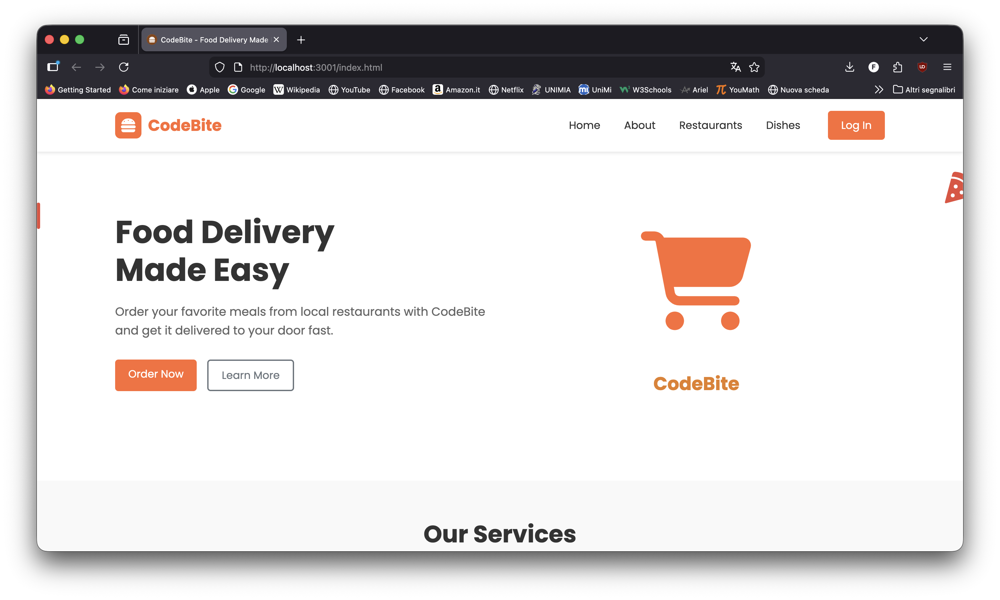

### Login

> 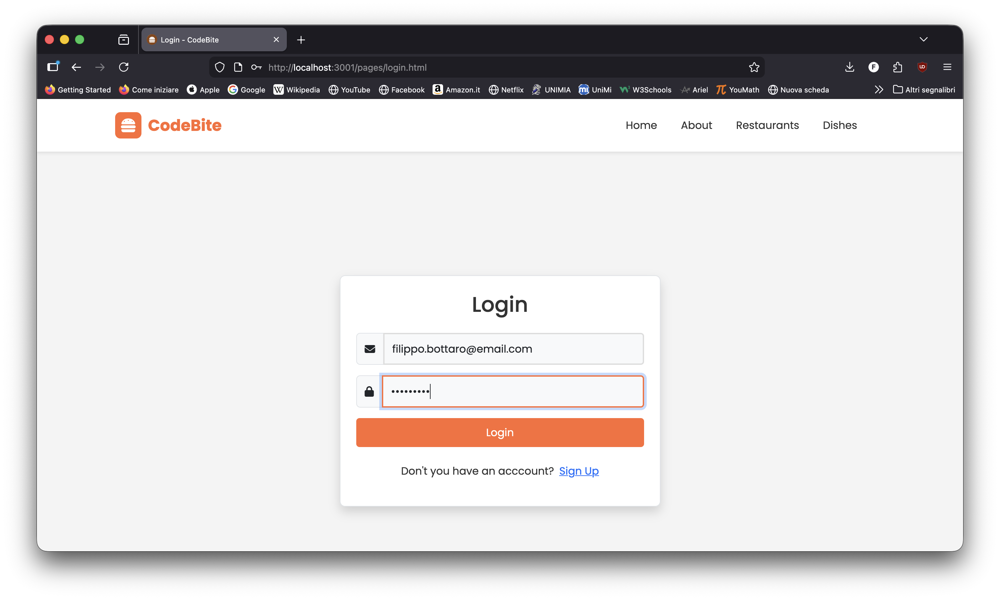

### Registrazione - Utente

> 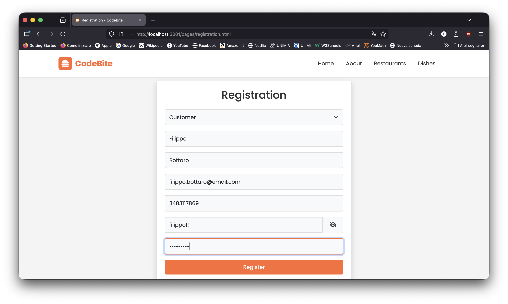

### Registrazione - Ristoratore

> 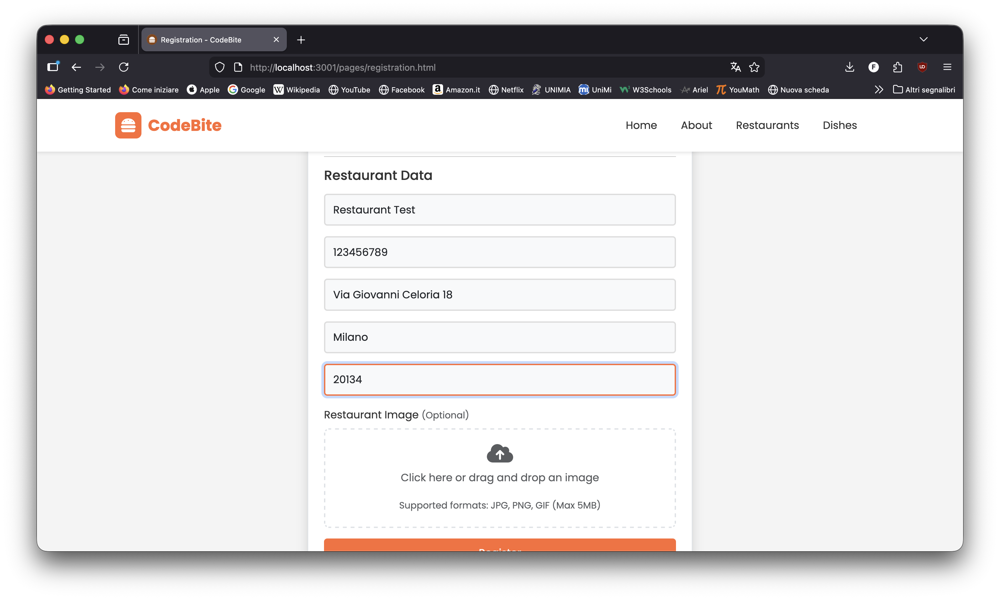

### Ricerca Ristoranti

> 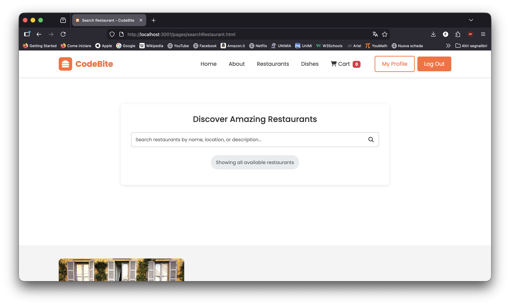

### Ricerca Piatti

> 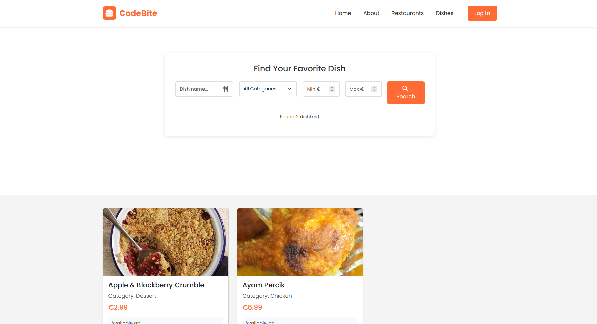

### Pagina Ristorante

> 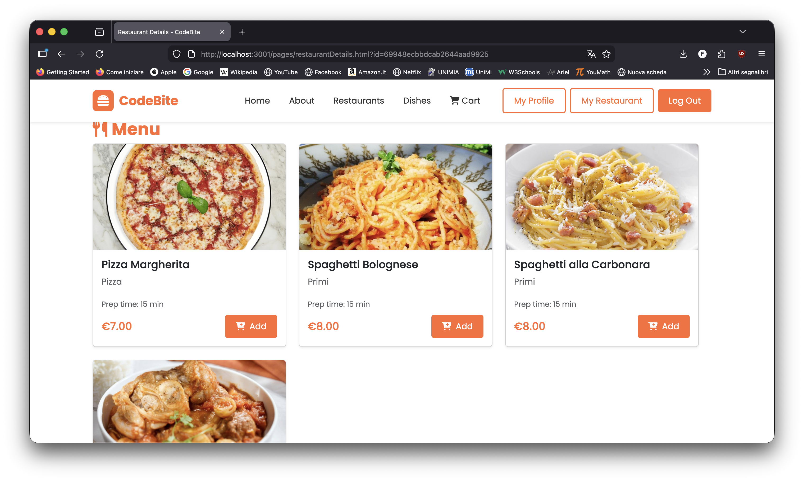

### Dashboard Ristoratore

> 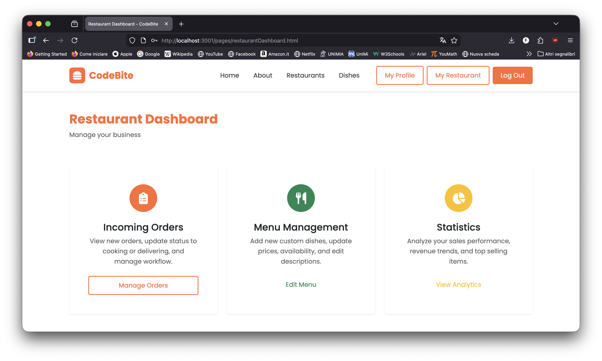

### Gestione Ordini (Ristoratore)

> 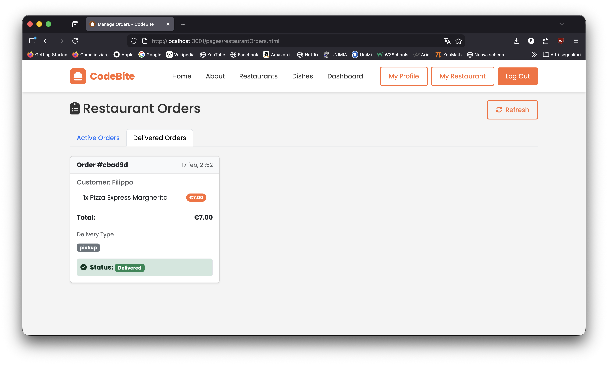

### Carrello

> 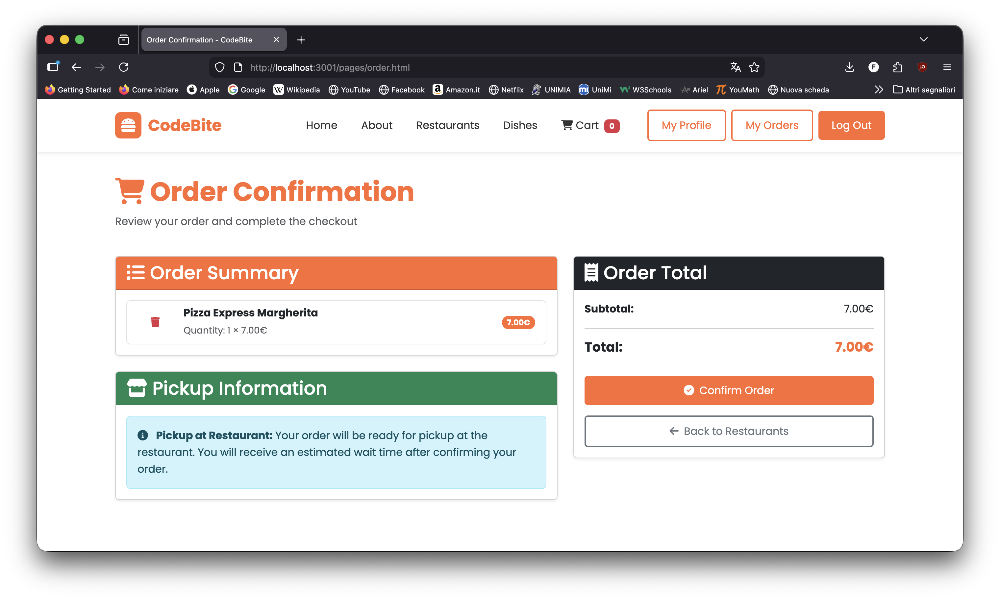

### Storico Ordini (Cliente)

> 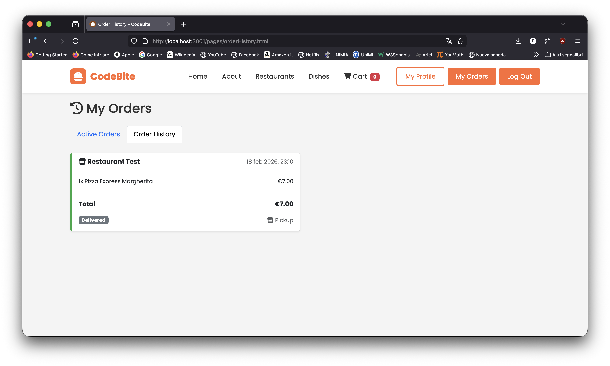

### Statistiche

> 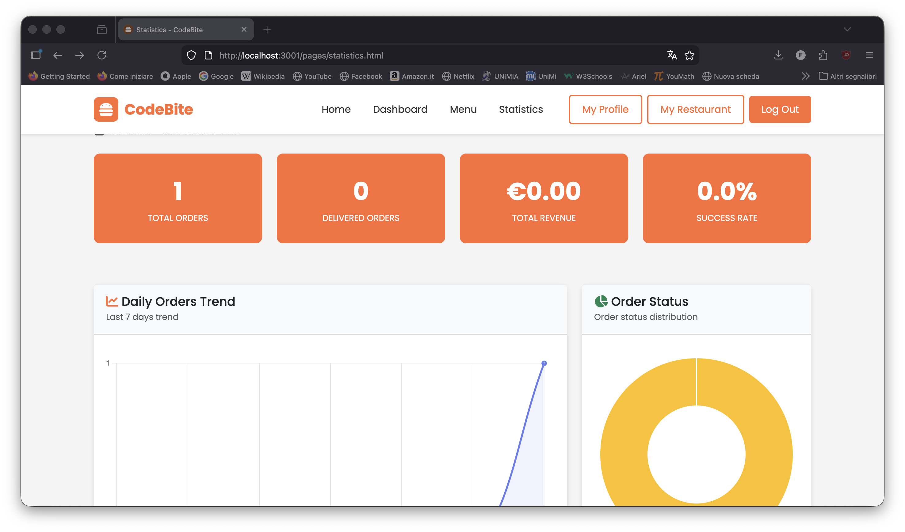

### Gestione Profilo

> 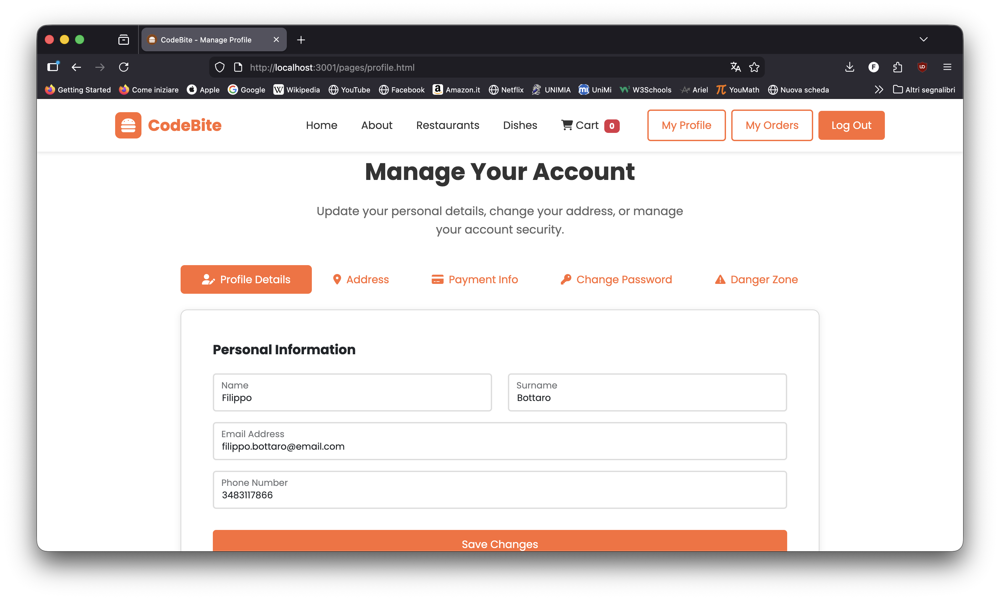

## Scelte implementative significative

- [Autenticazione ed Autorizzazione (JWT)](#autenticazione-ed-autorizzazione-jwt)
  - [Accesso endpoint API protetti (middleware `authMiddleware`)](#accesso-endpoint-api-protetti-middleware-authmiddleware)
  - [Accesso pagine web protette (controllo client-side)](#accesso-pagine-web-protette-controllo-client-side)
  - [Password hashing con bcrypt](#password-hashing-con-bcrypt)
- [Validazione richieste](#validazione-richieste)
  - [Express Validator](#express-validator)
- [Upload immagini ristoranti](#upload-immagini-ristoranti)
- [Gestione stati ordini](#gestione-stati-ordini)
- [Calcolo tempi di attesa](#calcolo-tempi-di-attesa)
- [Debouncing ricerche](#debouncing-ricerche)
- [Notifiche utente standardizzate](#notifiche-utente-standardizzate)
- [Gestione codici HTTP](#gestione-codici-http)
- [Documentazione API con Swagger](#documentazione-api-con-swagger)

## Autenticazione ed autorizzazione (JWT)

Per gestire le autorizzazioni di accesso alle varie pagine e ai vari endpoint dell'API ho utilizzato un meccanismo basato sui `JSON Web Token` (JWT):

- un utente effettua il login mandando all'endpoint `/api/auth/login` una richiesta POST con email e password
- in caso le credenziali siano corrette il server verifica la password con bcrypt, genera un JWT firmato contenente `userId` e `userType`, e lo invia al client nella risposta
- il client salva questo token nella `localStorage`:
  - può inviare richieste agli endpoint dell'API protetti, allegando il token nell'header `Authorization: Bearer <token>`
  - può accedere alle pagine protette del frontend: viene effettuata una verifica lato client controllando la presenza del token

### Accesso endpoint API protetti: middleware `authMiddleware`

Gli endpoint che richiedono l'autenticazione utilizzano il middleware `authMiddleware` (in `authMiddleware.js`), il quale:

- verifica la presenza del token JWT nell'header `Authorization`
- verifica la genuinità del token decodificandolo con la chiave segreta salvata nel file `.env`
- se valido, associa alla richiesta le informazioni dell'utente (id, userType)
- se non valido o mancante, restituisce errore 401 Unauthorized

Di seguito il codice del middleware `authMiddleware` che intercetta la richiesta:

```javascript
export const authMiddleware = (req, res, next) => {
    const authHeader = req.headers['authorization'];
    const token = authHeader && authHeader.split(' ')[1];

    if (!token) {
        return res.status(401).json({ message: 'No token, authorization denied' });
    }

    try {
        const decoded = jwt.verify(token, process.env.JWT_SECRET);
        req.user = decoded;
        next();
    } catch (error) {
        res.status(403).json({ message: 'Token is not valid' });
    }
};
```

Esempio di una rotta pubblica (il token non serve):

```javascript
router.post('/auth/login', async (req, res) => {
  // req.user : undefined
  // accessibile senza token
});
```

Esempio di una rotta privata (richiede il token):

```javascript
router.get('/user/profile', authMiddleware, async (req, res) => {
  // req.user : { id, userType, restaurantId? }
  // accessibile solo con token valido
});
```

### Accesso pagine web protette: controllo client-side

La verifica delle autorizzazioni lato frontend viene effettuata controllando la presenza del token JWT in localStorage e la validità del `userType` per pagine specifiche (es: solo restaurateur può accedere a `/pages/statistics.html`). Le pagine protette verificano all'avvio la presenza del token, altrimenti redirigono l'utente alla pagina di login `/pages/login.html`.

Questa è la funzione client-side che verifica il token e il ruolo:

```javascript
const checkAuth = () => {
    const token = localStorage.getItem('jwtToken');
    const userType = localStorage.getItem('userType');

    if (!token || userType !== 'restaurateur') {
        window.location.href = '../pages/login.html';
        return;
    }
};

document.addEventListener('DOMContentLoaded', () => {
    checkAuth();
    // Il caricamento dei dati statistici prosegue solo se il controllo ha successo
});
```

### Password hashing con bcrypt

Per garantire la sicurezza delle password ho usato bcrypt per l'hashing prima del salvataggio nel database. Il salt rounds è impostato a 10 (bilanciamento tra sicurezza e performance), l'hashing è one-way (impossibile recuperare la password originale) e avviene automaticamente tramite un pre-save hook nello schema Mongoose `User.js`, in modo da non doverlo ricordare ogni volta che si salva un utente.

Questo è il pre-save hook che ho configurato nel modello Mongoose:

```javascript
UserSchema.pre('save', async function (next) {
    if (!this.isModified('password')) {
        return next();
    }
    const salt = await bcrypt.genSalt(10);
    this.password = await bcrypt.hash(this.password, salt);
});
```

E questo è il momento in cui la password viene verificata durante il login:

```javascript
const user = await User.findOne({ email });
const isMatch = await bcrypt.compare(password, user.password);

if (!isMatch) {
    return res.status(401).json({ success: false, message: "Incorrect password." });
}

const token = jwt.sign({ id: user._id, userType: user.userType },
                       process.env.JWT_SECRET,
                       { expiresIn: 7200 });
```

## Validazione richieste

Ho implementato una validazione degli input su più livelli:

- a livello di frontend: validazione client-side con JavaScript per feedback immediato (verifica regex, campi obbligatori)
- a livello di backend: validazione server-side con `express-validator` per sicurezza
- a livello di database: schema Mongoose con validatori per garantire integrità dati

Questo garantisce che anche richieste inviate direttamente all'API (bypassando il frontend) vengano validate e sanificate.

### Express Validator

Per validare le richieste lato backend ho utilizzato la libreria [`express-validator`](https://express-validator.github.io/), che permette di definire regole di validazione per ogni campo della richiesta. Un vantaggio di questo approccio è la possibilità di definire validazioni condizionali (es: campi obbligatori solo per ristoratori) e messaggi di errore personalizzati. Le regole di validazione vengono definite attraverso un array di validation rules.

Ecco come ho configurato l'array di regole per la validazione:

```javascript
const registrationValidationRules = [
    body('name').notEmpty().withMessage('Name is required'),
    body('surname').notEmpty().withMessage('Surname is required'),
    body('email').isEmail().withMessage('Valid email is required'),
    body('password').isLength({ min: 8 }).withMessage('Password must be at least 8 characters'),
    body('confirmPassword').custom((value, { req }) => {
        if (value !== req.body.password) {
            throw new Error('Passwords do not match');
        }
        return true;
    }),
    body('userType').isIn(['customer', 'restaurateur']).withMessage('Invalid user type'),

    // Validazioni condizionali per ristoratori
    body('restaurantName').if(body('userType').equals('restaurateur')).notEmpty(),
    body('vatNumber').if(body('userType').equals('restaurateur')).notEmpty(),
    body('phone').if(body('userType').equals('restaurateur')).notEmpty()
];
```

E il modo in cui questo array viene inserito come middleware nella rotta:

```javascript
router.post('/auth/register', registrationValidationRules, async (req, res) => {
    const errors = validationResult(req);
    if (!errors.isEmpty()) {
        return res.status(400).json({ errors: errors.array() });
    }

    // Salvataggio effettivo nel DB (solo se non ci sono stati errori sopra)
    // const user = new User({ ... })
});
```

## Upload immagini

L'applicazione supporta l'upload di immagini per i ristoranti (durante la registrazione) e per i piatti del menu (tramite form submission supportate dall'oggetto `FormData` in `menuManagement.js`), utilizzando la libreria **Multer**.

```javascript
const storage = multer.diskStorage({
    destination: (req, file, cb) => {
        cb(null, 'uploads/restaurants/');
    },
    filename: (req, file, cb) => {
        const uniqueSuffix = Date.now() + '-' + Math.round(Math.random() * 1E9);
        cb(null, 'restaurant-' + uniqueSuffix + path.extname(file.originalname));
    }
});

const upload = multer({
    storage: storage,
    limits: { fileSize: 5 * 1024 * 1024 }, // 5MB max
    fileFilter: (req, file, cb) => {
        if (file.mimetype.startsWith('image/')) {
            return cb(null, true);
        }
        cb(new Error('Only image files allowed'));
    }
});
```

Il file viene salvato in `/uploads/restaurants/` con un nome univoco (`restaurant-{timestamp}-{random}.{ext}`) per evitare collisioni. La directory è servita staticamente da Express. La validazione controlla il MIME type (non solo l'estensione) per evitare che un utente rinomini un file `.exe` in `.jpg`. Il limite di dimensione è 5MB.

## Gestione stati ordini

Il sistema prevede il ritiro in ristorante (pickup). Gli ordini seguono un flusso di stati ben definito:

1. `ordered`: ordine appena creato dal cliente
2. `preparing`: ristoratore ha preso in carico l'ordine
3. `ready`: ordine pronto per il ritiro (segnalato dal ristoratore)
4. `delivered`: ordine ritirato (confermato dal cliente)

Le transizioni di stato valide sono:
- ristoratore: `ordered → preparing`, `preparing → ready` (per ordini in ritiro che necessitano di notifica al cliente), oppure `preparing → delivered` (per consegna diretta o ritiro immediato)
- cliente: `ready → delivered`

Il ristoratore può aggiornare lo stato dalla pagina `/pages/restaurantOrders.html`, che usa un sistema a tab per separare gli ordini attivi (`ordered`, `preparing`, `ready`) da quelli completati. Quando il ristoratore segna un ordine come `ready`, il cliente vede il pulsante "Confirm Pickup" nella pagina `/pages/orderHistory.html` e può portare l'ordine allo stato `delivered`. In caso di transizione diretta a `delivered`, l'ordine verrà automaticamente segnato come completato senza necessità di conferma da parte del cliente.

Nel controller, i cambi di stato vengono autorizzati con una logica di questo tipo:

```javascript
if (isRestaurateur) {
    if (status === 'preparing' && order.status === 'ordered') {
        isValidTransition = true;
    } else if (status === 'ready' && order.status === 'preparing') {
        isValidTransition = true;
    } else if (status === 'delivered' && order.status === 'preparing') {
        isValidTransition = true;
    }
} else {
    if (status === 'delivered' && order.status === 'ready') {
        isValidTransition = true;
    }
}
```

## Calcolo tempi di attesa

Il sistema calcola automaticamente il tempo di attesa stimato per ogni nuovo ordine basandosi sulla coda degli ordini attivi del ristorante.

La logica (`utils/waitTime.js`) recupera tutti gli ordini con stato `ordered` o `preparing` per il ristorante, calcola il tempo rimanente di ciascuno (tempo stimato meno il tempo già trascorso dalla creazione), trova il massimo tra tutti e ci somma il tempo di preparazione del nuovo ordine. Si usa il massimo e non la somma perché si assume che la cucina possa lavorare su più ordini in parallelo.

```javascript
export const calculateWaitTime = async (restaurantId, newOrderPrepTime) => {
    const pendingOrders = await Order.find({
        restaurant: restaurantId,
        status: { $in: ['ordered', 'preparing'] }
    });

    let maxRemainingTime = 0;
    const now = new Date();

    pendingOrders.forEach(order => {
        const elapsedMinutes = Math.floor((now - new Date(order.createdAt)) / 60000);
        const remainingTime = Math.max(0, order.estimatedPreparationTime - elapsedMinutes);
        if (remainingTime > maxRemainingTime) maxRemainingTime = remainingTime;
    });

    return Math.round(maxRemainingTime + newOrderPrepTime);
};
```

Il tempo viene mostrato al cliente al momento della conferma dell'ordine e salvato nel database come `estimatedPreparationTime`.

## Debouncing ricerche

La funzionalità di ricerca dei ristoranti implementa il debouncing per ottimizzare le richieste API. Senza debouncing, ogni pressione di tasto durante la digitazione scatenerebbe una richiesta al server, causando troppe richieste simultanee e potenzialmente aggiornamenti dell'UI con risultati non più attuali (se una richiesta più vecchia risponde dopo una più recente).

Con un delay di 300ms, la richiesta parte solo se l'utente non ha premuto altri tasti per almeno 300ms, cioè quando ha finito o ha fermato la digitazione.

La funzione di debounce che ritarda l'esecuzione della chiamata API:

```javascript
const debounce = (func, timeout = 300) => {
    let timer;
    return (...args) => {
        clearTimeout(timer);
        timer = setTimeout(() => { func.apply(this, args); }, timeout);
    };
}

searchInput.addEventListener('input', debounce(performSearch, 300));
```

## Notifiche utente standardizzate

Per evitare duplicazioni e garantire uno stile uniforme, ho creato una funzione helper centralizzata `showToast()` in `utils.js`, importata da tutte le pagine frontend. La funzione supporta 4 tipi di notifica (`success`, `warning`, `danger`, `info`) con gradienti di colore coerenti per ciascuno.

La funzione è ospitata nel file `utils.js` per poter essere riutilizzata ovunque:

```javascript
export const showToast = (message, type = 'danger') => {
    const bgColor = type === 'success'
        ? 'linear-gradient(to right, #4caf50, #81c784)'
        : type === 'warning'
        ? 'linear-gradient(to right, #ff9800, #ffb74d)'
        : type === 'info'
        ? 'linear-gradient(to right, #0dcaf0, #33ccff)'
        : 'linear-gradient(to right, #f44336, #e57373)';

    Toastify({
        text: message,
        duration: 3000,
        gravity: "top",
        position: "center",
        style: { background: bgColor }
    }).showToast();
};
```

Tutti i file frontend principali importano questa funzione:

```javascript
import { showToast } from "./utils.js";
// (altre istruzioni della pagina...)

showToast("Operazione completata!", "success");
```

Questo approccio rispetta il principio DRY (Don't Repeat Yourself): il codice di configurazione è scritto una volta sola, e qualsiasi modifica allo stile o alla durata si riflette istantaneamente su tutta l'applicazione.

## Gestione codici HTTP

L'applicazione usa i codici di stato HTTP standard per comunicare l'esito delle richieste:

- `200 OK`: richiesta elaborata correttamente (GET, PUT, DELETE)
- `201 Created`: nuova risorsa creata con successo (POST)
- `400 Bad Request`: dati inviati non validi o malformati (validazione fallita)
- `401 Unauthorized`: autenticazione richiesta (token mancante o non valido)
- `403 Forbidden`: utente autenticato ma senza permessi per la risorsa
- `404 Not Found`: risorsa richiesta non esistente
- `500 Internal Server Error`: errore interno del server

Un esempio di questa logica dal `restaurantController`:

```javascript
const restaurant = await Restaurant.findById(req.params.id);

if (!restaurant) {
    return res.status(404).json({ message: 'Restaurant not found' });
}

if (restaurant.owner.toString() !== req.user.id.toString()) {
    return res.status(403).json({ message: 'Not authorized to access this resource' });
}

res.status(200).json(restaurant);
```

## Documentazione API con Swagger

Ho usato `swagger-autogen` per generare automaticamente la documentazione Swagger dell'API, accessibile all'endpoint `/api/swagger`. La documentazione viene generata dal file `swagger.js` ad ogni avvio del server, quindi è sempre aggiornata con gli endpoint effettivamente esposti.

```javascript
const document = {
    info: {
        title: 'FastFood PMW API',
        description: 'API REST per CodeBite - Sistema gestione ordini fast food',
        version: '1.0.0'
    },
    host: 'localhost:3000',
    securityDefinitions: {
        bearerAuth: {
            type: 'apiKey',
            name: 'Authorization',
            in: 'header',
            description: 'JWT token nel formato: Bearer {token}'
        }
    },
    tags: [
        { name: 'Authentication', description: 'Autenticazione e registrazione' },
        { name: 'Users', description: 'Gestione profili utente' },
        { name: 'Restaurants', description: 'Gestione ristoranti' },
        { name: 'Meals', description: 'Gestione piatti' },
        { name: 'Orders', description: 'Gestione ordini' },
        { name: 'Statistics', description: 'Statistiche ristoranti' }
    ]
};

swaggerAutogen(outputFile, endpointFiles, document);
```

L'interfaccia permette di visualizzare tutti gli endpoint organizzati per tag, vedere gli schemi dati con esempi, testare le API direttamente con il pulsante "Try it out" e autenticarsi con token JWT per testare gli endpoint protetti.
